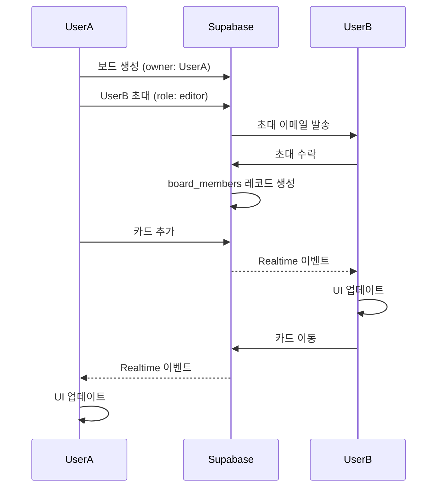
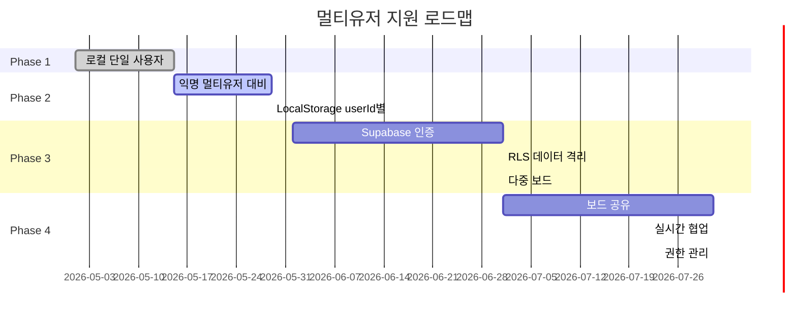

# 아키텍처: 칸반 보드 애플리케이션 (멀티유저 대비)

## 1. 아키텍처 개요

```mermaid
graph TD
    subgraph "Phase 1: 로컬 단일 사용자"
        A1[Browser] --> A2[JavaScript Array]
        A2 --> A3[DOM]
    end
    
    subgraph "Phase 2: 로컬 멀티유저 준비"
        B1[Browser] --> B2[User ID Manager]
        B2 --> B3[LocalStorage userId별]
        B3 --> B2
        B2 --> B4[JavaScript Array]
        B4 --> B5[DOM]
    end
    
    subgraph "Phase 3: Supabase 인증 + DB"
        C1[Browser] --> C2[Supabase Auth]
        C2 --> C3[User Session]
        C3 --> C4[Supabase DB RLS]
        C4 --> C5[JavaScript Array]
        C5 --> C6[DOM]
        C5 --> C4
    end
    
    subgraph "Phase 4: 실시간 협업"
        D1[Browser A] --> D2[Supabase Realtime]
        D3[Browser B] --> D2
        D2 --> D4[Supabase DB]
        D4 --> D2
    end
```



## 2. 데이터 격리 전략

### 2.1 Phase 1: 단일 사용자 (현재)
```javascript
// 전역 상태 - 사용자 구분 없음
let cards = [];
```

### 2.2 Phase 2: 익명 멀티유저 대비
```javascript
// 사용자 ID 기반 격리
let currentUserId = 'anonymous-uuid-123';
let cards = []; // 현재 사용자의 카드만

// LocalStorage 키 구조
// 'kanban-user-{userId}' -> 사용자별 데이터 분리
```

### 2.3 Phase 3: Supabase 인증 사용자
```javascript
// Supabase Auth 사용자 ID
let currentUserId = supabase.auth.user().id;

// Supabase RLS (Row Level Security)
// - 자동으로 사용자별 데이터 필터링
// - SQL 정책으로 데이터 접근 제어
```

## 3. 사용자 ID 관리

### 3.1 익명 사용자 ID 생성 (Phase 2)
```javascript
function initializeUserId() {
    let userId = localStorage.getItem('kanban-current-user');
    
    if (!userId) {
        // UUID 생성
        userId = 'anonymous-' + crypto.randomUUID();
        localStorage.setItem('kanban-current-user', userId);
    }
    
    return userId;
}
```

### 3.2 Supabase 로그인 (Phase 3)
```javascript
async function loginWithSupabase(email, password) {
    const { data, error } = await supabase.auth.signInWithPassword({
        email,
        password
    });
    
    if (error) throw error;
    
    // 익명 데이터 마이그레이션
    await migrateAnonymousToAuthenticated(data.user.id);
    
    return data.user;
}
```

### 3.3 데이터 마이그레이션
```javascript
async function migrateAnonymousToAuthenticated(supabaseUserId) {
    const anonymousUserId = localStorage.getItem('kanban-current-user');
    
    if (!anonymousUserId.startsWith('anonymous-')) return;
    
    // LocalStorage 익명 데이터 가져오기
    const localCards = getLocalCards(anonymousUserId);
    
    // Supabase로 복사
    await supabase.from('cards').insert(
        localCards.map(card => ({
            ...card,
            user_id: supabaseUserId
        }))
    );
    
    // 익명 데이터 정리
    localStorage.removeItem(`kanban-user-${anonymousUserId}`);
    localStorage.setItem('kanban-current-user', supabaseUserId);
}
```

## 4. LocalStorage 구조 (Phase 2)

```javascript
// 키 구조
{
    // 현재 활성 사용자
    "kanban-current-user": "anonymous-uuid-123",
    
    // 사용자별 카드 데이터
    "kanban-user-anonymous-uuid-123": "[{...cards}]",
    "kanban-user-anonymous-uuid-456": "[{...cards}]",
    
    // 사용자별 설정
    "kanban-settings-anonymous-uuid-123": "{theme:'dark'}",
}
```

## 5. Supabase 아키텍처 (Phase 3)

### 5.1 테이블 구조
```sql
-- auth.users (Supabase 자동 생성)

-- boards
boards (
    id UUID,
    owner_id UUID -> auth.users(id),
    name TEXT,
    ...
)

-- cards
cards (
    id BIGSERIAL,
    user_id UUID -> auth.users(id),
    board_id UUID -> boards(id),
    title TEXT,
    status TEXT,
    ...
)

-- board_members (협업용)
board_members (
    board_id UUID -> boards(id),
    user_id UUID -> auth.users(id),
    role TEXT
)
```

### 5.2 RLS 정책
```sql
-- 카드: 본인 것만 조회 가능
CREATE POLICY "Users see own cards"
ON cards FOR SELECT
USING (auth.uid() = user_id);

-- 공유 보드: 멤버도 조회 가능
CREATE POLICY "Members see board cards"
ON cards FOR SELECT
USING (
    EXISTS (
        SELECT 1 FROM board_members
        WHERE board_id = cards.board_id
        AND user_id = auth.uid()
    )
);
```

## 6. 오프라인 우선 동기화 (Phase 3+)

```javascript
// 로컬 우선 저장
async function addCardOfflineFirst(title, status) {
    // 1. 로컬에 즉시 저장
    const localCard = {
        id: Date.now(),
        title,
        status,
        userId: currentUserId,
        synced: false
    };
    
    cards.push(localCard);
    renderCard(localCard);
    
    // 2. 백그라운드에서 Supabase 동기화
    try {
        const { data } = await supabase
            .from('cards')
            .insert([localCard])
            .select()
            .single();
        
        // 3. 서버 ID로 업데이트
        const index = cards.findIndex(c => c.id === localCard.id);
        if (index !== -1) {
            cards[index] = { ...data, synced: true };
        }
    } catch (error) {
        console.error('Sync failed, will retry:', error);
        // 재시도 큐에 추가
        addToSyncQueue(localCard);
    }
}
```

## 7. 보드 공유 아키텍처 (Phase 4)



## 8. 보안 고려사항

### 8.1 Row Level Security (RLS)
- Supabase RLS로 데이터 접근 자동 제어
- SQL 정책으로 사용자별 격리 보장

### 8.2 API 키 보호
```javascript
// 환경 변수 사용 (공개 anon key만)
const supabaseUrl = import.meta.env.VITE_SUPABASE_URL;
const supabaseAnonKey = import.meta.env.VITE_SUPABASE_ANON_KEY;
```

### 8.3 입력 검증
```javascript
// 클라이언트 + 서버 양쪽 검증
function validateCardTitle(title) {
    return title && 
           title.length >= 1 && 
           title.length <= 200;
}
```

## 9. 확장성 고려사항

### 9.1 보드 개수 제한
```javascript
// 무료 플랜: 보드 5개
// 유료 플랜: 무제한
const MAX_BOARDS_FREE = 5;
```

### 9.2 카드 개수 제한
```javascript
// 보드당 카드 500개 (성능 고려)
const MAX_CARDS_PER_BOARD = 500;
```

### 9.3 멤버 수 제한
```javascript
// 무료 플랜: 보드당 3명
// 유료 플랜: 보드당 10명
const MAX_MEMBERS_FREE = 3;
```

## 10. Phase별 로드맵



## 11. 요약

### 핵심 원칙
1. **데이터 격리**: 사용자별 데이터 완전 분리 (LocalStorage/RLS)
2. **점진적 마이그레이션**: 익명 → 인증 사용자 자동 전환
3. **오프라인 우선**: 로컬 저장 후 백그라운드 동기화
4. **보안 기본**: RLS로 데이터 접근 자동 제어

### 기술 선택
- **Phase 2**: LocalStorage + UUID
- **Phase 3+**: Supabase Auth + PostgreSQL + RLS
- **실시간**: Supabase Realtime (WebSocket 기반)

### 예상 타임라인
- Phase 1 (완료): 2주
- Phase 2 (진행 중): 2주
- Phase 3 (예정): 1개월
- Phase 4 (예정): 1개월
