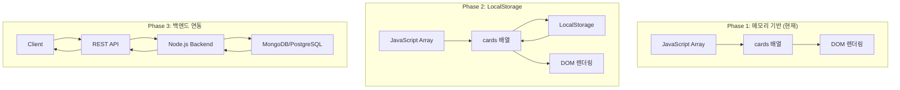

# Database Design: 칸반 보드 애플리케이션

## 1. 데이터 아키텍처 개요



## 2. Phase 1: 메모리 기반 데이터 구조 (현재)

### 2.1 카드 데이터 모델

```javascript
// Card Type Definition (멀티유저 대비 구조)
const Card = {
    id: Number,        // Unique identifier (timestamp: Date.now())
    title: String,     // Card title (1-200 characters)
    status: String,    // 'todo' | 'in-progress' | 'done'
    userId: String,    // User ID (Phase 2+: 익명 UUID, Phase 3+: Supabase user.id)
    boardId: String,   // Board ID (Phase 3+: 다중 보드 지원)
    createdAt: Number, // Timestamp
    updatedAt: Number  // Timestamp
};
```

### 2.2 전역 상태

```javascript
// Global State Variables
let currentUserId = null;    // Current user ID (Phase 2+)
let currentBoardId = 'default'; // Current board ID (Phase 3+)
let cards = [];              // Array of all cards (filtered by userId & boardId)
let draggedCard = null;      // Currently dragged card element (DOM)
let currentColumn = null;    // Target column for new card ('todo', 'in-progress', 'done')
```

### 2.3 샘플 데이터

```javascript
const sampleCards = [
    {
        id: 1,
        title: '프로젝트 기획서 작성',
        status: 'todo',
        userId: currentUserId,  // 현재 사용자 ID
        boardId: 'default',
        createdAt: Date.now(),
        updatedAt: Date.now()
    },
    {
        id: 2,
        title: 'UI 디자인 검토',
        status: 'todo',
        userId: currentUserId,
        boardId: 'default',
        createdAt: Date.now(),
        updatedAt: Date.now()
    },
    {
        id: 3,
        title: 'API 개발',
        status: 'in-progress',
        userId: currentUserId,
        boardId: 'default',
        createdAt: Date.now(),
        updatedAt: Date.now()
    },
    {
        id: 4,
        title: '데이터베이스 설계',
        status: 'done',
        userId: currentUserId,
        boardId: 'default',
        createdAt: Date.now(),
        updatedAt: Date.now()
    }
];
```

### 2.4 데이터 제약사항

| 필드 | 타입 | 필수 | 제약 | 기본값 |
|------|------|------|------|--------|
| `id` | Number | Yes | Unique, > 0 | `Date.now()` |
| `title` | String | Yes | 1-200 chars, not empty | - |
| `status` | String | Yes | Enum: 'todo', 'in-progress', 'done' | 'todo' |
| `userId` | String | Yes (Phase 2+) | UUID or Supabase user.id | `currentUserId` |
| `boardId` | String | Yes (Phase 3+) | Board identifier | 'default' |
| `createdAt` | Number | Yes | Timestamp | `Date.now()` |
| `updatedAt` | Number | Yes | Timestamp | `Date.now()` |

### 2.5 데이터 조작 함수 (멀티유저 대비)

```javascript
// Create
function addCard(title, status) {
    const card = {
        id: Date.now(),
        title: title,
        status: status,
        userId: currentUserId,       // 현재 사용자 ID
        boardId: currentBoardId,     // 현재 보드 ID
        createdAt: Date.now(),
        updatedAt: Date.now()
    };
    cards.push(card);
    return card;
}

// Read (사용자별 필터링)
function getCardById(id) {
    return cards.find(card => 
        card.id === id && 
        card.userId === currentUserId &&
        card.boardId === currentBoardId
    );
}

function getCardsByStatus(status) {
    return cards.filter(card => 
        card.status === status &&
        card.userId === currentUserId &&
        card.boardId === currentBoardId
    );
}

function getAllUserCards() {
    return cards.filter(card => 
        card.userId === currentUserId &&
        card.boardId === currentBoardId
    );
}

// Update
function updateCardStatus(id, newStatus) {
    const card = getCardById(id);
    if (card) {
        card.status = newStatus;
        card.updatedAt = Date.now();
    }
    return card;
}

// Delete (사용자 확인)
function deleteCard(id) {
    const card = getCardById(id);
    if (!card) {
        console.error('Card not found or access denied');
        return false;
    }
    cards = cards.filter(card => card.id !== id);
    return true;
}
```

## 3. Phase 2: LocalStorage 데이터 구조 (예정)

### 3.1 LocalStorage 스키마 (멀티유저 구조)

```javascript
// Phase 2: 사용자별 Key 구조
// Key: 'kanban-user-{userId}'
localStorage.setItem(`kanban-user-${currentUserId}`, JSON.stringify(cards));

// Phase 3: 보드별 Key 구조
// Key: 'kanban-{userId}-{boardId}'
localStorage.setItem(`kanban-${currentUserId}-${currentBoardId}`, JSON.stringify(cards));

// 현재 사용자 ID 저장
localStorage.setItem('kanban-current-user', currentUserId);

// Example Stored Data (Phase 2)
{
    "kanban-current-user": "anonymous-uuid-123",
    "kanban-user-anonymous-uuid-123": "[{\"id\":1715596800000,\"title\":\"프로젝트 기획서\",\"status\":\"todo\",\"userId\":\"anonymous-uuid-123\",\"boardId\":\"default\",\"createdAt\":1715596800000,\"updatedAt\":1715596800000}]"
}

// Example Stored Data (Phase 3 - Supabase Auth)
{
    "kanban-current-user": "supabase-user-abc123",
    "kanban-supabase-user-abc123-default": "[...]",
    "kanban-supabase-user-abc123-work": "[...]",
    "kanban-supabase-user-abc123-personal": "[...]"
}
```

### 3.2 메타데이터 스토리지

```javascript
// Metadata Schema
const metadata = {
    version: '1.0.0',           // Schema version
    lastUpdated: 1715596800000, // Timestamp
    totalCards: 10,             // Total card count
    settings: {
        theme: 'light',          // UI theme
        autoSave: true           // Auto-save enabled
    }
};

localStorage.setItem('kanban-metadata', JSON.stringify(metadata));
```

### 3.3 사용자 ID 관리

```javascript
// 현재 사용자 ID 초기화 (Phase 2)
function initializeUserId() {
    let userId = localStorage.getItem('kanban-current-user');
    
    if (!userId) {
        // 익명 사용자 UUID 생성
        userId = 'anonymous-' + generateUUID();
        localStorage.setItem('kanban-current-user', userId);
        console.log('Created anonymous user:', userId);
    }
    
    currentUserId = userId;
    return userId;
}

// UUID 생성
function generateUUID() {
    return 'xxxxxxxx-xxxx-4xxx-yxxx-xxxxxxxxxxxx'.replace(/[xy]/g, function(c) {
        const r = Math.random() * 16 | 0;
        const v = c === 'x' ? r : (r & 0x3 | 0x8);
        return v.toString(16);
    });
}

// Phase 3: Supabase 로그인 후 사용자 전환
function switchUser(supabaseUserId) {
    const oldUserId = currentUserId;
    currentUserId = supabaseUserId;
    
    localStorage.setItem('kanban-current-user', supabaseUserId);
    
    // 익명 데이터 마이그레이션 제안
    if (oldUserId && oldUserId.startsWith('anonymous-')) {
        migrateAnonymousData(oldUserId, supabaseUserId);
    }
}
```

### 3.4 데이터 저장/불러오기 함수

```javascript
// Save to LocalStorage (멀티유저)
function saveToStorage() {
    try {
        const storageKey = `kanban-${currentUserId}-${currentBoardId}`;
        const data = JSON.stringify(cards);
        localStorage.setItem(storageKey, data);
        
        // Update metadata
        const metadata = {
            version: '1.0.0',
            lastUpdated: Date.now(),
            totalCards: cards.length
        };
        localStorage.setItem('kanban-metadata', JSON.stringify(metadata));
        
        return true;
    } catch (error) {
        console.error('Failed to save to LocalStorage:', error);
        
        // Handle quota exceeded
        if (error.name === 'QuotaExceededError') {
            alert('저장 공간이 부족합니다. 오래된 카드를 삭제해주세요.');
        }
        
        return false;
    }
}

// Load from LocalStorage
function loadFromStorage() {
    try {
        const data = localStorage.getItem('kanban-cards');
        
        if (data) {
            const parsed = JSON.parse(data);
            
            // Validate schema
            if (validateCards(parsed)) {
                cards = parsed;
                return true;
            } else {
                console.warn('Invalid data format. Loading sample cards.');
                return false;
            }
        }
        
        return false; // No data found
    } catch (error) {
        console.error('Failed to load from LocalStorage:', error);
        return false;
    }
}

// Validate card schema
function validateCards(data) {
    if (!Array.isArray(data)) return false;
    
    return data.every(card => {
        return (
            typeof card.id === 'number' &&
            typeof card.title === 'string' &&
            card.title.length > 0 &&
            card.title.length <= 200 &&
            ['todo', 'in-progress', 'done'].includes(card.status)
        );
    });
}

// Clear storage
function clearStorage() {
    localStorage.removeItem('kanban-cards');
    localStorage.removeItem('kanban-metadata');
}

// Export data
function exportData() {
    const data = {
        cards: cards,
        metadata: {
            version: '1.0.0',
            exportedAt: new Date().toISOString(),
            totalCards: cards.length
        }
    };
    
    const json = JSON.stringify(data, null, 2);
    const blob = new Blob([json], { type: 'application/json' });
    const url = URL.createObjectURL(blob);
    
    const a = document.createElement('a');
    a.href = url;
    a.download = `kanban-backup-${Date.now()}.json`;
    a.click();
    
    URL.revokeObjectURL(url);
}

// Import data
function importData(file) {
    const reader = new FileReader();
    
    reader.onload = (e) => {
        try {
            const data = JSON.parse(e.target.result);
            
            if (data.cards && validateCards(data.cards)) {
                cards = data.cards;
                saveToStorage();
                renderAllCards();
                alert('데이터를 성공적으로 가져왔습니다.');
            } else {
                alert('잘못된 파일 형식입니다.');
            }
        } catch (error) {
            console.error('Import failed:', error);
            alert('파일을 읽는 중 오류가 발생했습니다.');
        }
    };
    
    reader.readAsText(file);
}
```

### 3.4 자동 저장 전략

```javascript
// Auto-save on every change
function autoSave() {
    // Debounce to prevent excessive saves
    clearTimeout(autoSave.timer);
    autoSave.timer = setTimeout(() => {
        saveToStorage();
    }, 500); // Save 500ms after last change
}

// Call autoSave after every data modification
function addCard(title, status) {
    const card = { id: Date.now(), title, status };
    cards.push(card);
    autoSave();
    return card;
}

function deleteCard(id) {
    cards = cards.filter(card => card.id !== id);
    autoSave();
}

function updateCardStatus(id, newStatus) {
    const card = getCardById(id);
    if (card) {
        card.status = newStatus;
        autoSave();
    }
    return card;
}
```

### 3.5 용량 관리

```javascript
// Check LocalStorage usage
function getStorageSize() {
    let total = 0;
    for (let key in localStorage) {
        if (localStorage.hasOwnProperty(key)) {
            total += localStorage[key].length + key.length;
        }
    }
    return (total / 1024).toFixed(2); // KB
}

// Check remaining quota (approximate)
function getStorageQuota() {
    const used = getStorageSize();
    const limit = 5120; // ~5MB (varies by browser)
    const remaining = limit - used;
    
    return {
        used: used,
        remaining: remaining,
        limit: limit,
        percentage: ((used / limit) * 100).toFixed(2)
    };
}

// Clean old cards (keep last 100)
function cleanOldCards() {
    if (cards.length > 100) {
        cards.sort((a, b) => b.id - a.id); // Sort by ID (newest first)
        cards = cards.slice(0, 100);
        saveToStorage();
        alert('오래된 카드가 자동으로 정리되었습니다.');
    }
}
```

## 4. Phase 3: 백엔드 데이터베이스 설계 (예정)

### 4.1 기술 스택 옵션

| 옵션 | 데이터베이스 | ORM/ODM | 특징 |
|------|-------------|---------|------|
| **Option A** | MongoDB | Mongoose | NoSQL, 스키마 유연성, 빠른 개발 |
| **Option B** | PostgreSQL | Sequelize | RDBMS, 데이터 무결성, 복잡한 쿼리 |
| **Option C** | Supabase (PostgreSQL) | Supabase Client | Backend-as-a-Service, 인증/실시간 포함 |

### 4.2 MongoDB 스키마 (Option A)

```javascript
// Card Schema (Mongoose)
const mongoose = require('mongoose');

const cardSchema = new mongoose.Schema({
    title: {
        type: String,
        required: true,
        minlength: 1,
        maxlength: 200,
        trim: true
    },
    description: {
        type: String,
        maxlength: 2000,
        default: ''
    },
    status: {
        type: String,
        enum: ['todo', 'in-progress', 'done'],
        default: 'todo',
        required: true
    },
    userId: {
        type: mongoose.Schema.Types.ObjectId,
        ref: 'User',
        required: true
    },
    boardId: {
        type: mongoose.Schema.Types.ObjectId,
        ref: 'Board',
        required: true
    },
    priority: {
        type: String,
        enum: ['low', 'medium', 'high'],
        default: 'medium'
    },
    dueDate: {
        type: Date,
        default: null
    },
    tags: [{
        type: String,
        maxlength: 50
    }],
    createdAt: {
        type: Date,
        default: Date.now
    },
    updatedAt: {
        type: Date,
        default: Date.now
    }
}, {
    timestamps: true
});

// Indexes
cardSchema.index({ boardId: 1, status: 1 });
cardSchema.index({ userId: 1 });
cardSchema.index({ createdAt: -1 });

const Card = mongoose.model('Card', cardSchema);

// User Schema
const userSchema = new mongoose.Schema({
    email: {
        type: String,
        required: true,
        unique: true,
        lowercase: true,
        trim: true
    },
    username: {
        type: String,
        required: true,
        unique: true,
        minlength: 3,
        maxlength: 30
    },
    password: {
        type: String,
        required: true
    },
    boards: [{
        type: mongoose.Schema.Types.ObjectId,
        ref: 'Board'
    }],
    createdAt: {
        type: Date,
        default: Date.now
    }
}, {
    timestamps: true
});

const User = mongoose.model('User', userSchema);

// Board Schema
const boardSchema = new mongoose.Schema({
    name: {
        type: String,
        required: true,
        maxlength: 100
    },
    description: {
        type: String,
        maxlength: 500
    },
    ownerId: {
        type: mongoose.Schema.Types.ObjectId,
        ref: 'User',
        required: true
    },
    members: [{
        userId: {
            type: mongoose.Schema.Types.ObjectId,
            ref: 'User'
        },
        role: {
            type: String,
            enum: ['owner', 'admin', 'member'],
            default: 'member'
        }
    }],
    columns: [{
        name: String,
        order: Number
    }],
    createdAt: {
        type: Date,
        default: Date.now
    }
}, {
    timestamps: true
});

const Board = mongoose.model('Board', boardSchema);
```

### 4.3 PostgreSQL 스키마 (Option B)

```sql
-- Users Table
CREATE TABLE users (
    id SERIAL PRIMARY KEY,
    email VARCHAR(255) UNIQUE NOT NULL,
    username VARCHAR(30) UNIQUE NOT NULL,
    password_hash VARCHAR(255) NOT NULL,
    created_at TIMESTAMP DEFAULT CURRENT_TIMESTAMP,
    updated_at TIMESTAMP DEFAULT CURRENT_TIMESTAMP
);

-- Boards Table
CREATE TABLE boards (
    id SERIAL PRIMARY KEY,
    name VARCHAR(100) NOT NULL,
    description TEXT,
    owner_id INTEGER NOT NULL REFERENCES users(id) ON DELETE CASCADE,
    created_at TIMESTAMP DEFAULT CURRENT_TIMESTAMP,
    updated_at TIMESTAMP DEFAULT CURRENT_TIMESTAMP
);

-- Cards Table
CREATE TABLE cards (
    id SERIAL PRIMARY KEY,
    title VARCHAR(200) NOT NULL,
    description TEXT,
    status VARCHAR(20) NOT NULL CHECK (status IN ('todo', 'in-progress', 'done')),
    priority VARCHAR(10) CHECK (priority IN ('low', 'medium', 'high')),
    user_id INTEGER NOT NULL REFERENCES users(id) ON DELETE CASCADE,
    board_id INTEGER NOT NULL REFERENCES boards(id) ON DELETE CASCADE,
    due_date TIMESTAMP,
    created_at TIMESTAMP DEFAULT CURRENT_TIMESTAMP,
    updated_at TIMESTAMP DEFAULT CURRENT_TIMESTAMP
);

-- Board Members Table (Many-to-Many)
CREATE TABLE board_members (
    id SERIAL PRIMARY KEY,
    board_id INTEGER NOT NULL REFERENCES boards(id) ON DELETE CASCADE,
    user_id INTEGER NOT NULL REFERENCES users(id) ON DELETE CASCADE,
    role VARCHAR(20) DEFAULT 'member' CHECK (role IN ('owner', 'admin', 'member')),
    joined_at TIMESTAMP DEFAULT CURRENT_TIMESTAMP,
    UNIQUE(board_id, user_id)
);

-- Card Tags Table (Many-to-Many)
CREATE TABLE card_tags (
    id SERIAL PRIMARY KEY,
    card_id INTEGER NOT NULL REFERENCES cards(id) ON DELETE CASCADE,
    tag_name VARCHAR(50) NOT NULL,
    UNIQUE(card_id, tag_name)
);

-- Indexes
CREATE INDEX idx_cards_board_id ON cards(board_id);
CREATE INDEX idx_cards_user_id ON cards(user_id);
CREATE INDEX idx_cards_status ON cards(status);
CREATE INDEX idx_cards_created_at ON cards(created_at DESC);
CREATE INDEX idx_board_members_board_id ON board_members(board_id);
CREATE INDEX idx_board_members_user_id ON board_members(user_id);

-- Trigger: Update updated_at on modification
CREATE OR REPLACE FUNCTION update_updated_at_column()
RETURNS TRIGGER AS $$
BEGIN
    NEW.updated_at = CURRENT_TIMESTAMP;
    RETURN NEW;
END;
$$ LANGUAGE plpgsql;

CREATE TRIGGER update_users_updated_at
    BEFORE UPDATE ON users
    FOR EACH ROW
    EXECUTE FUNCTION update_updated_at_column();

CREATE TRIGGER update_boards_updated_at
    BEFORE UPDATE ON boards
    FOR EACH ROW
    EXECUTE FUNCTION update_updated_at_column();

CREATE TRIGGER update_cards_updated_at
    BEFORE UPDATE ON cards
    FOR EACH ROW
    EXECUTE FUNCTION update_updated_at_column();
```

### 4.4 REST API 엔드포인트 설계

```javascript
// Cards API
GET    /api/boards/:boardId/cards           // Get all cards
GET    /api/boards/:boardId/cards/:id       // Get card by ID
POST   /api/boards/:boardId/cards           // Create new card
PUT    /api/boards/:boardId/cards/:id       // Update card
PATCH  /api/boards/:boardId/cards/:id       // Partial update (status only)
DELETE /api/boards/:boardId/cards/:id       // Delete card

// Request/Response Examples

// POST /api/boards/1/cards
{
    "title": "프로젝트 기획서 작성",
    "description": "Q2 프로젝트 기획서 초안 작성",
    "status": "todo",
    "priority": "high",
    "dueDate": "2026-05-20T00:00:00Z"
}

// Response: 201 Created
{
    "id": 123,
    "title": "프로젝트 기획서 작성",
    "description": "Q2 프로젝트 기획서 초안 작성",
    "status": "todo",
    "priority": "high",
    "dueDate": "2026-05-20T00:00:00.000Z",
    "userId": 1,
    "boardId": 1,
    "createdAt": "2026-05-13T10:30:00.000Z",
    "updatedAt": "2026-05-13T10:30:00.000Z"
}

// PATCH /api/boards/1/cards/123
{
    "status": "in-progress"
}

// Response: 200 OK
{
    "id": 123,
    "status": "in-progress",
    "updatedAt": "2026-05-13T11:00:00.000Z"
}
```

### 4.5 실시간 동기화 (WebSocket)

```javascript
// WebSocket Events
socket.on('card:created', (card) => {
    // Add card to UI
});

socket.on('card:updated', (card) => {
    // Update card in UI
});

socket.on('card:deleted', (cardId) => {
    // Remove card from UI
});

socket.on('card:moved', ({ cardId, newStatus }) => {
    // Update card status in UI
});

// Emit events
socket.emit('card:create', cardData);
socket.emit('card:update', { id, data });
socket.emit('card:delete', cardId);
socket.emit('card:move', { cardId, newStatus });
```

## 5. 데이터 마이그레이션 전략

### 5.1 Phase 1 → Phase 2 (메모리 → LocalStorage)

```javascript
// Migration on first load
function migrateToLocalStorage() {
    const data = localStorage.getItem('kanban-cards');
    
    if (!data) {
        // First time: save sample cards
        saveToStorage();
        console.log('Migration complete: Initial data saved to LocalStorage');
    }
}

window.onload = () => {
    migrateToLocalStorage();
    // ... rest of initialization
};
```

### 5.2 Phase 2 → Phase 3 (LocalStorage → Supabase)

```javascript
// 익명 사용자 데이터를 인증 사용자로 마이그레이션
async function migrateAnonymousData(anonymousUserId, supabaseUserId) {
    const storageKey = `kanban-${anonymousUserId}-default`;
    const localCards = JSON.parse(localStorage.getItem(storageKey) || '[]');
    
    if (localCards.length === 0) {
        console.log('No anonymous data to migrate');
        return;
    }
    
    const shouldMigrate = confirm(
        `익명으로 저장된 ${localCards.length}개의 카드를 계정으로 이전하시겠습니까?`
    );
    
    if (!shouldMigrate) return;
    
    console.log(`Migrating ${localCards.length} cards to Supabase...`);
    
    try {
        // Supabase에 카드 일괄 삽입
        const cardsToInsert = localCards.map(card => ({
            title: card.title,
            status: card.status,
            user_id: supabaseUserId,
            board_id: 'default',
            created_at: new Date(card.createdAt).toISOString()
        }));
        
        const { data, error } = await supabase
            .from('cards')
            .insert(cardsToInsert);
        
        if (error) throw error;
        
        console.log('Migration complete:', data);
        
        // 백업 후 익명 데이터 삭제
        localStorage.removeItem(storageKey);
        
        alert('데이터가 성공적으로 계정으로 이전되었습니다.');
        
    } catch (error) {
        console.error('Migration failed:', error);
        alert('마이그레이션에 실패했습니다. 데이터는 로컬에 유지됩니다.');
    }
}

// Export LocalStorage data for backup
function exportForMigration() {
    const storageKey = `kanban-${currentUserId}-${currentBoardId}`;
    const cards = JSON.parse(localStorage.getItem(storageKey) || '[]');
    
    // Transform data for API
    const apiData = cards.map(card => ({
        title: card.title,
        status: card.status,
        description: '',
        priority: 'medium',
        userId: currentUser.id,
        boardId: defaultBoard.id
    }));
    
    return apiData;
}

// Bulk import to backend
async function migrateToBackend() {
    const cards = exportForMigration();
    
    try {
        const response = await fetch('/api/cards/bulk-import', {
            method: 'POST',
            headers: { 'Content-Type': 'application/json' },
            body: JSON.stringify({ cards })
        });
        
        if (response.ok) {
            console.log('Migration complete: Data synced to backend');
            // Clear LocalStorage after successful migration
            localStorage.removeItem('kanban-cards');
        }
    } catch (error) {
        console.error('Migration failed:', error);
    }
}
```

## 6. 데이터 백업 및 복구

### 6.1 자동 백업 (LocalStorage)

```javascript
// Backup to file every week
function autoBackup() {
    const lastBackup = localStorage.getItem('last-backup');
    const now = Date.now();
    const oneWeek = 7 * 24 * 60 * 60 * 1000;
    
    if (!lastBackup || (now - parseInt(lastBackup)) > oneWeek) {
        exportData();
        localStorage.setItem('last-backup', now.toString());
    }
}
```

### 6.2 클라우드 백업 (Phase 3)

```javascript
// Backup to cloud storage (S3, Google Cloud Storage, etc.)
async function backupToCloud() {
    const cards = await fetch('/api/boards/1/cards').then(r => r.json());
    
    const backup = {
        timestamp: new Date().toISOString(),
        data: cards
    };
    
    await fetch('/api/backups', {
        method: 'POST',
        headers: { 'Content-Type': 'application/json' },
        body: JSON.stringify(backup)
    });
}
```

## 7. 요약

### Phase별 데이터 전략

| Phase | 저장 방식 | 용량 | 지속성 | 다중 사용자 | 동기화 |
|-------|----------|------|--------|-------------|--------|
| **Phase 1** | 메모리 (Array) | 무제한 | 세션만 | No | No |
| **Phase 2** | LocalStorage | ~5MB | 영구 | No | No |
| **Phase 3** | 백엔드 DB | 무제한 | 영구 | Yes | Real-time |

### 권장 사항
- **Phase 1**: 프로토타입 및 개념 검증
- **Phase 2**: 개인용 도구로 실사용
- **Phase 3**: 팀 협업 도구로 확장
