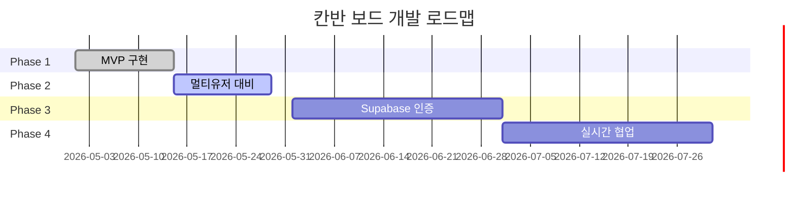

# 칸반 보드 애플리케이션

복수 사용자를 위한 드래그 앤 드롭 칸반 보드 웹 애플리케이션입니다. 로컬에서 시작하여 Supabase 인증 및 실시간 협업까지 확장 가능한 구조로 설계되었습니다.

## 🎯 프로젝트 비전

개인 사용자부터 소규모 팀까지, 누구나 쉽게 작업을 관리할 수 있는 칸반 보드를 제공합니다.
- Phase 1: 로컬 단일 사용자 (MVP)
- Phase 2: 익명 멀티유저 대비 (LocalStorage 격리)
- Phase 3: Supabase 인증 연동 (클라우드 동기화)
- Phase 4: 실시간 협업 (보드 공유)

## ✨ 주요 기능

### Phase 1 (현재)
- ✅ 3개 컬럼 칸반 보드 (To-Do, In Progress, Done)
- ✅ 드래그 앤 드롭으로 카드 이동
- ✅ 카드 추가/삭제
- ✅ 반응형 디자인 (데스크톱/모바일)
- ✅ 부드러운 애니메이션

### Phase 2 (예정)
- ⏳ LocalStorage 데이터 저장 (사용자별 격리)
- ⏳ 익명 사용자 ID 관리
- ⏳ 카드 수정 기능
- ⏳ 데이터 내보내기/가져오기

### Phase 3 (예정)
- ⏳ Supabase 인증 (이메일, Google, GitHub)
- ⏳ 사용자별 데이터 분리 (RLS)
- ⏳ 다중 보드 생성 및 관리
- ⏳ 익명 → 인증 사용자 데이터 마이그레이션

### Phase 4 (예정)
- ⏳ 보드 공유 및 멤버 초대
- ⏳ 실시간 협업 (Supabase Realtime)
- ⏳ 권한 관리 (owner, editor, viewer)

## 🚀 빠른 시작

### 로컬 실행
```bash
# 1. 파일 열기
open kanban.html
# 또는
python3 -m http.server 8000
# http://localhost:8000/kanban.html
```

### Phase 3+ (Supabase 설정)
```bash
# 1. Supabase 클라이언트 설치
npm install @supabase/supabase-js

# 2. 환경 변수 설정
VITE_SUPABASE_URL=your-project-url
VITE_SUPABASE_ANON_KEY=your-anon-key

# 3. Supabase 테이블 생성 (SQL 실행)
# DATABASE_DESIGN.md 참고
```

## 📁 프로젝트 구조

```
.
├── kanban.html           # 메인 HTML
├── kanban.css            # 스타일시트
├── kanban.js             # 애플리케이션 로직
├── README.md             # 프로젝트 개요 (이 파일)
├── ARCHITECTURE.md       # 멀티유저 아키텍처
├── PRD.md                # 제품 요구사항 정의서
├── TRD.md                # 기술 요구사항 정의서
├── DATABASE_DESIGN.md    # 데이터베이스 설계
├── STORAGE_PLAN.md       # 스토리지 전략
├── DESIGN_SYSTEM.md      # 디자인 시스템
├── USER_FLOW.md          # 사용자 흐름도
├── TASKS.md              # 구현 작업 목록
├── CONVENTIONS.md        # 코딩 컨벤션
└── PLAN.md               # 초기 계획서
```

## 🏗️ 아키텍처

### 멀티유저 데이터 격리

```javascript
// Phase 1: 단일 사용자 (현재)
let cards = [];

// Phase 2: 익명 멀티유저
let currentUserId = 'anonymous-uuid-123';
let cards = []; // userId 필터링된 데이터

// Phase 3: Supabase 인증
let currentUserId = supabase.auth.user().id;
// RLS로 자동 격리
```

### LocalStorage 구조 (Phase 2+)

```javascript
{
    "kanban-current-user": "anonymous-uuid-123",
    "kanban-user-anonymous-uuid-123": "[{cards}]",
    "kanban-user-supabase-abc123": "[{cards}]"
}
```

### Supabase RLS (Phase 3+)

```sql
-- 사용자별 카드만 조회 가능
CREATE POLICY "Users see own cards"
ON cards FOR SELECT
USING (auth.uid() = user_id);
```

## 📊 데이터 모델

### 카드 (Phase 1)
```javascript
{
    id: 1715596800000,
    title: '프로젝트 기획서 작성',
    status: 'todo' // 'todo' | 'in-progress' | 'done'
}
```

### 카드 (Phase 2+ 멀티유저 대비)
```javascript
{
    id: 1715596800000,
    title: '프로젝트 기획서 작성',
    status: 'todo',
    userId: 'anonymous-uuid-123',  // 사용자 격리
    boardId: 'default',            // 다중 보드 지원
    createdAt: 1715596800000,
    updatedAt: 1715596800000
}
```

### Supabase 테이블 (Phase 3+)
```sql
cards (
    id BIGSERIAL PRIMARY KEY,
    title VARCHAR(200) NOT NULL,
    status VARCHAR(20) NOT NULL,
    user_id UUID NOT NULL REFERENCES auth.users(id),
    board_id UUID NOT NULL REFERENCES boards(id),
    created_at TIMESTAMP DEFAULT NOW(),
    updated_at TIMESTAMP DEFAULT NOW()
)
```

## 🛠️ 기술 스택

### Frontend
- HTML5 (시맨틱 마크업)
- CSS3 (Grid, Flexbox, 애니메이션)
- JavaScript (ES6+, Vanilla JS)

### Backend (Phase 3+)
- Supabase
  - Supabase Auth (인증)
  - PostgreSQL (데이터베이스)
  - Row Level Security (데이터 격리)
  - Realtime (실시간 동기화)

## 📖 주요 문서

### 제품 및 기획
- **[PRD.md](./PRD.md)**: 제품 요구사항, 사용자 스토리, 성공 지표
- **[USER_FLOW.md](./USER_FLOW.md)**: 10+ Mermaid 다이어그램으로 사용자 여정 시각화

### 기술 및 아키텍처
- **[ARCHITECTURE.md](./ARCHITECTURE.md)**: 멀티유저 아키텍처 및 데이터 격리 전략
- **[TRD.md](./TRD.md)**: 기술 스택, 성능, 보안, 브라우저 호환성
- **[DATABASE_DESIGN.md](./DATABASE_DESIGN.md)**: 데이터 모델, Supabase 스키마, RLS 정책
- **[STORAGE_PLAN.md](./STORAGE_PLAN.md)**: LocalStorage 및 Supabase 저장 전략

### 디자인 및 개발
- **[DESIGN_SYSTEM.md](./DESIGN_SYSTEM.md)**: 색상, 타이포그래피, 컴포넌트 스타일
- **[CONVENTIONS.md](./CONVENTIONS.md)**: HTML/CSS/JavaScript 코딩 규칙
- **[TASKS.md](./TASKS.md)**: Phase별 구현 체크리스트 (150+ 항목)

## 🎨 디자인 시스템

### 색상
- Primary: `#667eea` (보라)
- To-Do: `#e74c3c` (빨강)
- In Progress: `#f39c12` (주황)
- Done: `#27ae60` (초록)

### 타이포그래피
- Font: `Segoe UI, sans-serif`
- Base Size: `1rem (16px)`

### 레이아웃
- Desktop: 3컬럼 Grid
- Mobile: 1컬럼 Stack

## 🔒 보안

### Phase 2 (LocalStorage)
- XSS 방지 (`textContent` 사용)
- 사용자별 데이터 격리 (userId 기반)
- 입력 검증 (제목 1-200자)

### Phase 3+ (Supabase)
- Row Level Security (RLS)로 자동 데이터 격리
- Supabase Auth로 안전한 인증
- HTTPS 통신 (Supabase 자동 제공)

## 🧪 테스트

### 브라우저 호환성
- ✅ Chrome 90+
- ✅ Firefox 88+
- ✅ Safari 14+
- ✅ Edge 90+

### 테스트 전략 (Phase 5)
- 단위 테스트: Jest
- E2E 테스트: Playwright
- 접근성: WAVE, axe DevTools

## 📈 로드맵



### Phase별 목표

| Phase | 기간 | 주요 기능 | 상태 |
|-------|------|-----------|------|
| Phase 1 | 2주 | 로컬 단일 사용자 MVP | ✅ 완료 |
| Phase 2 | 2주 | LocalStorage + userId 격리 | 🔄 진행 중 |
| Phase 3 | 1개월 | Supabase 인증 + 다중 보드 | ⏳ 예정 |
| Phase 4 | 1개월 | 보드 공유 + 실시간 협업 | ⏳ 예정 |

## 🤝 기여 가이드

### 개발 워크플로우
1. 기능 브랜치 생성: `feature/add-feature`
2. 코딩 컨벤션 준수 ([CONVENTIONS.md](./CONVENTIONS.md))
3. 커밋 메시지 규칙: `feat: Add feature`
4. Pull Request 생성
5. 코드 리뷰 후 병합

### 작업 우선순위
- **P0**: Phase 2 사용자 ID 관리, LocalStorage 격리
- **P1**: 카드 수정, 데이터 접근 제어
- **P2**: Supabase 인증, 다중 보드
- **P3**: 실시간 협업, 보드 공유

## 📝 라이선스

MIT License

## 👥 팀

- **개발자**: secretnote89
- **AI Assistant**: Claude Sonnet 4.5

## 📞 문의

- GitHub Issues: [프로젝트 이슈](https://github.com/your-repo/issues)
- 문서 피드백: [CONVENTIONS.md](./CONVENTIONS.md) 참고

---

**참고**: 이 프로젝트는 개인 사용자부터 팀 협업까지 확장 가능한 구조로 설계되었습니다. Phase별로 점진적으로 기능을 추가하며, 각 단계에서 안정적으로 동작하도록 보장합니다.
# kanban
