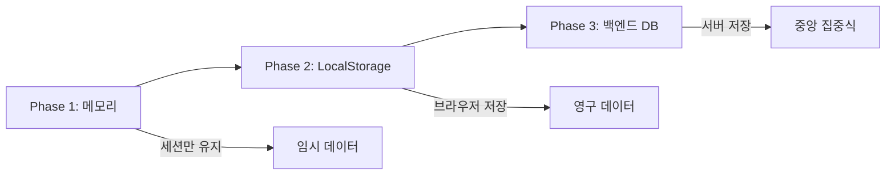

# 스토리지 사용계획: 칸반 보드 애플리케이션

## 1. 개요

이 문서는 칸반 보드 애플리케이션의 데이터 저장 및 관리 전략을 정의합니다.
Phase별로 다른 스토리지 방식을 사용하며, 각 단계의 요구사항과 제약사항을 다룹니다.

---

## 2. Phase별 스토리지 전략



| Phase | 저장 방식 | 지속성 | 용량 | 사용자 격리 | 공유 | 동기화 |
|-------|----------|--------|------|------------|------|--------|
| **Phase 1** | JavaScript Array | 세션만 | 무제한 | ❌ | ❌ | ❌ |
| **Phase 2** | LocalStorage (userId별) | 영구 | ~5MB | ✅ | ❌ | ❌ |
| **Phase 3** | Supabase (RLS) | 영구 | 무제한 | ✅ | ✅ | ✅ |

---

## 3. Phase 1: 메모리 기반 스토리지 (현재)

### 3.1 데이터 구조

```javascript
// Global State
let cards = [
    {
        id: 1715596800000,
        title: '프로젝트 기획서 작성',
        status: 'todo'
    },
    {
        id: 1715596801000,
        title: 'API 개발',
        status: 'in-progress'
    }
];

let draggedCard = null;      // DOM element
let currentColumn = null;    // 'todo' | 'in-progress' | 'done'
```

### 3.2 특징
- **장점**:
  - 구현 간단
  - 빠른 접근 속도
  - 용량 제한 없음
  
- **단점**:
  - 페이지 새로고침 시 데이터 손실
  - 브라우저 간 공유 불가
  - 영구 저장 불가

### 3.3 사용 사례
- 프로토타입 개발
- MVP 테스트
- 데모 및 프레젠테이션

---

## 4. Phase 2: LocalStorage 기반 스토리지

### 4.1 LocalStorage 개요

LocalStorage는 브라우저에서 제공하는 Key-Value 저장소입니다.

**특징**:
- 도메인별로 독립적인 저장 공간
- 브라우저를 닫아도 데이터 유지
- 동기적 API (Synchronous)
- 문자열만 저장 가능 (JSON 직렬화 필요)

**용량 제한**:
- Chrome: ~10MB
- Firefox: ~10MB
- Safari: ~5MB
- Edge: ~10MB

### 4.2 데이터 스키마

```javascript
// Key: 'kanban-cards'
// Value: JSON String
localStorage.setItem('kanban-cards', JSON.stringify([
    {
        id: 1715596800000,
        title: '프로젝트 기획서 작성',
        status: 'todo',
        createdAt: '2026-05-13T10:00:00.000Z',
        updatedAt: '2026-05-13T10:00:00.000Z'
    }
]));

// Key: 'kanban-metadata'
// Value: JSON String
localStorage.setItem('kanban-metadata', JSON.stringify({
    version: '1.0.0',
    lastUpdated: 1715596800000,
    totalCards: 10,
    settings: {
        theme: 'light',
        autoSave: true
    }
}));
```

### 4.3 저장/불러오기 구현

#### 4.3.1 저장 함수

```javascript
function saveToStorage() {
    try {
        // 데이터 직렬화
        const data = JSON.stringify(cards);
        
        // LocalStorage에 저장
        localStorage.setItem('kanban-cards', data);
        
        // 메타데이터 업데이트
        const metadata = {
            version: '1.0.0',
            lastUpdated: Date.now(),
            totalCards: cards.length
        };
        localStorage.setItem('kanban-metadata', JSON.stringify(metadata));
        
        console.log('Data saved successfully');
        return true;
        
    } catch (error) {
        console.error('Failed to save:', error);
        
        // Quota 초과 처리
        if (error.name === 'QuotaExceededError') {
            handleQuotaExceeded();
        }
        
        return false;
    }
}
```

#### 4.3.2 불러오기 함수

```javascript
function loadFromStorage() {
    try {
        // LocalStorage에서 데이터 가져오기
        const data = localStorage.getItem('kanban-cards');
        
        if (!data) {
            console.log('No data found. Loading sample cards.');
            return false;
        }
        
        // JSON 파싱
        const parsed = JSON.parse(data);
        
        // 스키마 검증
        if (validateCards(parsed)) {
            cards = parsed;
            console.log(`Loaded ${cards.length} cards from storage`);
            return true;
        } else {
            console.warn('Invalid data format. Loading sample cards.');
            return false;
        }
        
    } catch (error) {
        console.error('Failed to load:', error);
        
        // 손상된 데이터 처리
        if (error instanceof SyntaxError) {
            console.error('Corrupted data. Resetting storage.');
            clearStorage();
        }
        
        return false;
    }
}
```

#### 4.3.3 스키마 검증

```javascript
function validateCards(data) {
    // 배열인지 확인
    if (!Array.isArray(data)) {
        return false;
    }
    
    // 각 카드의 필드 검증
    return data.every(card => {
        return (
            typeof card.id === 'number' &&
            card.id > 0 &&
            typeof card.title === 'string' &&
            card.title.length > 0 &&
            card.title.length <= 200 &&
            ['todo', 'in-progress', 'done'].includes(card.status)
        );
    });
}
```

### 4.4 자동 저장 전략

```javascript
// Debounced Auto-Save (500ms 후 저장)
let autoSaveTimer = null;

function autoSave() {
    clearTimeout(autoSaveTimer);
    autoSaveTimer = setTimeout(() => {
        saveToStorage();
    }, 500);
}

// 모든 데이터 변경 함수에 autoSave 호출
function addCard(title, status) {
    const card = {
        id: Date.now(),
        title: title,
        status: status
    };
    cards.push(card);
    autoSave(); // ← 자동 저장
    return card;
}

function deleteCard(id) {
    cards = cards.filter(card => card.id !== id);
    autoSave(); // ← 자동 저장
}

function updateCardStatus(id, newStatus) {
    const card = cards.find(c => c.id === id);
    if (card) {
        card.status = newStatus;
        autoSave(); // ← 자동 저장
    }
}
```

### 4.5 용량 관리

#### 4.5.1 저장 공간 확인

```javascript
function getStorageSize() {
    let total = 0;
    
    for (let key in localStorage) {
        if (localStorage.hasOwnProperty(key)) {
            const value = localStorage[key];
            total += key.length + value.length;
        }
    }
    
    // KB 단위로 반환
    return (total / 1024).toFixed(2);
}

function getStorageInfo() {
    const used = getStorageSize();
    const limit = 5120; // ~5MB (Safari 기준)
    const remaining = limit - used;
    const percentage = ((used / limit) * 100).toFixed(2);
    
    return {
        used: `${used} KB`,
        remaining: `${remaining} KB`,
        limit: `${limit} KB`,
        percentage: `${percentage}%`
    };
}

// 사용 예시
console.log(getStorageInfo());
// { used: "12.5 KB", remaining: "5107.5 KB", limit: "5120 KB", percentage: "0.24%" }
```

#### 4.5.2 Quota 초과 처리

```javascript
function handleQuotaExceeded() {
    // 1. 사용자에게 경고
    const shouldClean = confirm(
        '저장 공간이 부족합니다.\n' +
        '오래된 카드를 자동으로 정리하시겠습니까?'
    );
    
    if (shouldClean) {
        cleanOldCards();
    } else {
        // 2. 수동 내보내기 제안
        const shouldExport = confirm(
            '데이터를 파일로 내보내시겠습니까?\n' +
            '(이후 LocalStorage를 초기화합니다)'
        );
        
        if (shouldExport) {
            exportData();
            clearStorage();
        }
    }
}

function cleanOldCards() {
    if (cards.length <= 100) {
        alert('정리할 카드가 없습니다.');
        return;
    }
    
    // 최신 100개만 유지
    cards.sort((a, b) => b.id - a.id);
    cards = cards.slice(0, 100);
    
    saveToStorage();
    
    alert('오래된 카드가 정리되었습니다.');
}
```

### 4.6 데이터 내보내기/가져오기

#### 4.6.1 JSON 파일로 내보내기

```javascript
function exportData() {
    // 내보낼 데이터 구성
    const exportData = {
        version: '1.0.0',
        exportedAt: new Date().toISOString(),
        totalCards: cards.length,
        cards: cards
    };
    
    // JSON 문자열 변환 (들여쓰기 포함)
    const json = JSON.stringify(exportData, null, 2);
    
    // Blob 생성
    const blob = new Blob([json], { type: 'application/json' });
    
    // 다운로드 링크 생성
    const url = URL.createObjectURL(blob);
    const a = document.createElement('a');
    a.href = url;
    a.download = `kanban-backup-${Date.now()}.json`;
    a.click();
    
    // 메모리 정리
    URL.revokeObjectURL(url);
    
    console.log('Data exported successfully');
}
```

#### 4.6.2 JSON 파일에서 가져오기

```javascript
function importData(file) {
    const reader = new FileReader();
    
    reader.onload = (e) => {
        try {
            // JSON 파싱
            const data = JSON.parse(e.target.result);
            
            // 스키마 검증
            if (!data.cards || !validateCards(data.cards)) {
                throw new Error('Invalid file format');
            }
            
            // 데이터 덮어쓰기 확인
            const shouldOverwrite = confirm(
                `${data.totalCards}개의 카드를 가져옵니다.\n` +
                '기존 데이터가 모두 삭제됩니다. 계속하시겠습니까?'
            );
            
            if (!shouldOverwrite) {
                return;
            }
            
            // 데이터 적용
            cards = data.cards;
            saveToStorage();
            
            // UI 업데이트
            renderAllCards();
            updateCounts();
            
            alert('데이터를 성공적으로 가져왔습니다.');
            
        } catch (error) {
            console.error('Import failed:', error);
            alert('파일을 읽는 중 오류가 발생했습니다.');
        }
    };
    
    reader.onerror = () => {
        alert('파일을 읽을 수 없습니다.');
    };
    
    reader.readAsText(file);
}

// HTML에 파일 입력 추가
// <input type="file" id="importFile" accept=".json">

document.getElementById('importFile').addEventListener('change', (e) => {
    const file = e.target.files[0];
    if (file) {
        importData(file);
    }
});
```

### 4.7 데이터 초기화

```javascript
function clearStorage() {
    if (confirm('모든 데이터를 삭제하시겠습니까? (복구 불가)')) {
        localStorage.removeItem('kanban-cards');
        localStorage.removeItem('kanban-metadata');
        
        cards = [];
        renderAllCards();
        updateCounts();
        
        alert('데이터가 초기화되었습니다.');
    }
}
```

### 4.8 초기화 플로우

```javascript
window.addEventListener('DOMContentLoaded', () => {
    // 1. LocalStorage에서 데이터 불러오기 시도
    const loaded = loadFromStorage();
    
    if (!loaded) {
        // 2. 데이터가 없으면 샘플 카드 로드
        loadSampleCards();
    }
    
    // 3. UI 렌더링
    renderAllCards();
    updateCounts();
    
    // 4. 이벤트 리스너 등록
    attachEventListeners();
});

function loadSampleCards() {
    cards = [
        {
            id: Date.now(),
            title: '프로젝트 기획서 작성',
            status: 'todo'
        },
        {
            id: Date.now() + 1,
            title: 'UI 디자인 검토',
            status: 'todo'
        },
        {
            id: Date.now() + 2,
            title: 'API 개발',
            status: 'in-progress'
        },
        {
            id: Date.now() + 3,
            title: '데이터베이스 설계',
            status: 'done'
        }
    ];
    
    // 샘플 카드도 저장
    saveToStorage();
}
```

---

## 5. Phase 3: 백엔드 데이터베이스

### 5.1 데이터베이스 선택

| 데이터베이스 | 장점 | 단점 | 적합성 |
|-------------|------|------|--------|
| **MongoDB** | NoSQL, 스키마 유연성, 빠른 개발 | 복잡한 쿼리 제한 | ⭐⭐⭐⭐⭐ |
| **PostgreSQL** | RDBMS, 데이터 무결성, 복잡한 쿼리 | 스키마 변경 어려움 | ⭐⭐⭐⭐ |
| **Supabase** | Backend-as-a-Service, 인증 포함 | 벤더 종속성 | ⭐⭐⭐⭐⭐ |

**권장**: MongoDB 또는 Supabase

### 5.2 MongoDB 스키마

```javascript
// cards 컬렉션
{
    _id: ObjectId("..."),
    title: "프로젝트 기획서 작성",
    description: "Q2 프로젝트 기획서 초안 작성",
    status: "todo",
    userId: ObjectId("..."),
    boardId: ObjectId("..."),
    priority: "high",
    dueDate: ISODate("2026-05-20T00:00:00Z"),
    tags: ["기획", "문서"],
    createdAt: ISODate("2026-05-13T10:00:00Z"),
    updatedAt: ISODate("2026-05-13T10:00:00Z")
}

// users 컬렉션
{
    _id: ObjectId("..."),
    email: "user@example.com",
    username: "john_doe",
    passwordHash: "$2b$10$...",
    boards: [ObjectId("...")],
    createdAt: ISODate("2026-05-13T10:00:00Z")
}

// boards 컬렉션
{
    _id: ObjectId("..."),
    name: "프로젝트 A",
    description: "Q2 프로젝트 관리",
    ownerId: ObjectId("..."),
    members: [
        {
            userId: ObjectId("..."),
            role: "owner"
        }
    ],
    columns: [
        { name: "To-Do", order: 0 },
        { name: "In Progress", order: 1 },
        { name: "Done", order: 2 }
    ],
    createdAt: ISODate("2026-05-13T10:00:00Z")
}
```

### 5.3 REST API 엔드포인트

```javascript
// Cards API
GET    /api/boards/:boardId/cards           // 모든 카드 조회
GET    /api/boards/:boardId/cards/:id       // 카드 상세 조회
POST   /api/boards/:boardId/cards           // 카드 생성
PUT    /api/boards/:boardId/cards/:id       // 카드 전체 수정
PATCH  /api/boards/:boardId/cards/:id       // 카드 부분 수정 (status만)
DELETE /api/boards/:boardId/cards/:id       // 카드 삭제

// Boards API
GET    /api/boards                          // 내 보드 목록
POST   /api/boards                          // 보드 생성
GET    /api/boards/:id                      // 보드 상세 조회
PUT    /api/boards/:id                      // 보드 수정
DELETE /api/boards/:id                      // 보드 삭제

// Auth API
POST   /api/auth/register                   // 회원가입
POST   /api/auth/login                      // 로그인
POST   /api/auth/logout                     // 로그아웃
GET    /api/auth/me                         // 현재 사용자 정보
```

### 5.4 프론트엔드 데이터 레이어

```javascript
// API Client
class KanbanAPI {
    constructor(baseURL) {
        this.baseURL = baseURL;
        this.token = localStorage.getItem('auth-token');
    }
    
    async request(method, endpoint, data = null) {
        const options = {
            method: method,
            headers: {
                'Content-Type': 'application/json',
                'Authorization': `Bearer ${this.token}`
            }
        };
        
        if (data) {
            options.body = JSON.stringify(data);
        }
        
        const response = await fetch(`${this.baseURL}${endpoint}`, options);
        
        if (!response.ok) {
            throw new Error(`API Error: ${response.statusText}`);
        }
        
        return response.json();
    }
    
    // Cards
    async getCards(boardId) {
        return this.request('GET', `/boards/${boardId}/cards`);
    }
    
    async createCard(boardId, card) {
        return this.request('POST', `/boards/${boardId}/cards`, card);
    }
    
    async updateCard(boardId, cardId, updates) {
        return this.request('PATCH', `/boards/${boardId}/cards/${cardId}`, updates);
    }
    
    async deleteCard(boardId, cardId) {
        return this.request('DELETE', `/boards/${boardId}/cards/${cardId}`);
    }
}

// 사용 예시
const api = new KanbanAPI('https://api.example.com/api');

// 카드 생성
const newCard = await api.createCard(boardId, {
    title: '새 작업',
    status: 'todo'
});

// 카드 이동
await api.updateCard(boardId, cardId, {
    status: 'in-progress'
});
```

### 5.5 실시간 동기화 (WebSocket)

```javascript
// Socket.IO 클라이언트
const socket = io('https://api.example.com');

// 보드 구독
socket.emit('subscribe', { boardId: '123' });

// 카드 생성 이벤트 수신
socket.on('card:created', (card) => {
    cards.push(card);
    renderCard(card);
    updateCounts();
});

// 카드 업데이트 이벤트 수신
socket.on('card:updated', (updatedCard) => {
    const index = cards.findIndex(c => c.id === updatedCard.id);
    if (index !== -1) {
        cards[index] = updatedCard;
        // UI 업데이트
    }
});

// 카드 삭제 이벤트 수신
socket.on('card:deleted', (cardId) => {
    cards = cards.filter(c => c.id !== cardId);
    document.querySelector(`[data-id="${cardId}"]`)?.remove();
    updateCounts();
});
```

---

## 6. 마이그레이션 전략

### 6.1 Phase 1 → Phase 2

```javascript
// 첫 로드 시 LocalStorage에 샘플 데이터 저장
function migrateToPhase2() {
    const hasData = localStorage.getItem('kanban-cards');
    
    if (!hasData) {
        console.log('First time: Saving sample cards to LocalStorage');
        saveToStorage();
    }
}
```

### 6.2 Phase 2 → Phase 3

```javascript
// LocalStorage에서 백엔드로 마이그레이션
async function migrateToPhase3() {
    const localCards = JSON.parse(localStorage.getItem('kanban-cards') || '[]');
    
    if (localCards.length === 0) {
        console.log('No data to migrate');
        return;
    }
    
    console.log(`Migrating ${localCards.length} cards to backend...`);
    
    try {
        // 벌크 임포트 API 호출
        const response = await api.request('POST', '/cards/bulk-import', {
            cards: localCards
        });
        
        console.log('Migration complete:', response);
        
        // 백업 후 LocalStorage 정리
        exportData(); // 백업 파일 다운로드
        localStorage.removeItem('kanban-cards');
        
        alert('데이터가 성공적으로 서버로 이전되었습니다.');
        
    } catch (error) {
        console.error('Migration failed:', error);
        alert('마이그레이션에 실패했습니다. 데이터는 LocalStorage에 유지됩니다.');
    }
}
```

---

## 7. 백업 및 복구 전략

### 7.1 자동 백업 (Phase 2)

```javascript
// 7일마다 자동 백업
function setupAutoBackup() {
    const BACKUP_INTERVAL = 7 * 24 * 60 * 60 * 1000; // 7일
    const lastBackup = localStorage.getItem('last-backup-time');
    const now = Date.now();
    
    if (!lastBackup || (now - parseInt(lastBackup)) > BACKUP_INTERVAL) {
        exportData();
        localStorage.setItem('last-backup-time', now.toString());
        console.log('Auto backup completed');
    }
}

// 앱 시작 시 실행
window.addEventListener('DOMContentLoaded', setupAutoBackup);
```

### 7.2 클라우드 백업 (Phase 3)

```javascript
// 일일 백업을 서버에 저장
async function backupToCloud() {
    const cards = await api.getCards(boardId);
    
    const backup = {
        timestamp: new Date().toISOString(),
        boardId: boardId,
        data: cards
    };
    
    await api.request('POST', '/backups', backup);
    console.log('Cloud backup completed');
}

// 매일 자정에 실행 (서버 크론잡)
```

---

## 8. 성능 최적화

### 8.1 LocalStorage 최적화

```javascript
// Throttle: 1초에 최대 1번만 저장
let lastSaveTime = 0;
const SAVE_THROTTLE = 1000; // 1초

function throttledSave() {
    const now = Date.now();
    if (now - lastSaveTime > SAVE_THROTTLE) {
        saveToStorage();
        lastSaveTime = now;
    }
}
```

### 8.2 메모리 최적화

```javascript
// 최대 카드 개수 제한
const MAX_CARDS = 500;

function addCard(title, status) {
    if (cards.length >= MAX_CARDS) {
        alert(`최대 ${MAX_CARDS}개까지만 생성할 수 있습니다.`);
        return null;
    }
    
    // 카드 생성 로직
}
```

---

## 9. 보안 고려사항

### 9.1 LocalStorage 보안

```javascript
// 민감 정보는 LocalStorage에 저장 금지
// ❌ 나쁜 예
localStorage.setItem('password', userPassword);
localStorage.setItem('credit-card', cardNumber);

// ✅ 좋은 예
// 민감 정보는 서버에만 저장
// LocalStorage에는 토큰만 저장 (HttpOnly Cookie 권장)
```

### 9.2 XSS 방지

```javascript
// 사용자 입력을 textContent로 삽입
function renderCard(card) {
    const cardElement = document.createElement('div');
    cardElement.className = 'card';
    
    const title = document.createElement('span');
    title.className = 'card-title';
    title.textContent = card.title; // ✅ XSS 방지
    // title.innerHTML = card.title; // ❌ XSS 취약
    
    cardElement.appendChild(title);
}
```

---

## 10. 테스트 전략

### 10.1 LocalStorage 테스트

```javascript
// Jest 테스트 예시
describe('LocalStorage', () => {
    beforeEach(() => {
        localStorage.clear();
    });
    
    test('should save cards to LocalStorage', () => {
        cards = [{ id: 1, title: 'Test', status: 'todo' }];
        saveToStorage();
        
        const saved = localStorage.getItem('kanban-cards');
        expect(saved).toBeDefined();
        expect(JSON.parse(saved)).toHaveLength(1);
    });
    
    test('should load cards from LocalStorage', () => {
        const testCards = [{ id: 1, title: 'Test', status: 'todo' }];
        localStorage.setItem('kanban-cards', JSON.stringify(testCards));
        
        const loaded = loadFromStorage();
        expect(loaded).toBe(true);
        expect(cards).toEqual(testCards);
    });
    
    test('should handle corrupted data', () => {
        localStorage.setItem('kanban-cards', 'invalid json');
        
        const loaded = loadFromStorage();
        expect(loaded).toBe(false);
    });
});
```

---

## 11. 모니터링 및 로깅

### 11.1 저장 공간 모니터링

```javascript
function monitorStorage() {
    const info = getStorageInfo();
    
    console.log('Storage Usage:', info);
    
    // 80% 이상 사용 시 경고
    if (parseFloat(info.percentage) > 80) {
        console.warn('Storage usage is over 80%');
        // 사용자에게 알림 또는 자동 정리
    }
}

// 5분마다 체크
setInterval(monitorStorage, 5 * 60 * 1000);
```

### 11.2 에러 로깅

```javascript
function logStorageError(operation, error) {
    const errorLog = {
        timestamp: new Date().toISOString(),
        operation: operation,
        error: error.message,
        stack: error.stack
    };
    
    console.error('Storage Error:', errorLog);
    
    // Sentry 등 에러 추적 서비스에 전송
    // Sentry.captureException(error);
}
```

---

## 12. 요약

### Phase별 체크리스트

#### Phase 1 (완료)
- [x] 메모리 기반 카드 배열
- [x] 기본 CRUD 기능
- [x] 세션 동안만 데이터 유지

#### Phase 2 (예정)
- [ ] LocalStorage 저장/불러오기
- [ ] 자동 저장 (Debounce)
- [ ] 데이터 검증
- [ ] 내보내기/가져오기
- [ ] 용량 관리
- [ ] 에러 처리

#### Phase 3 (장기)
- [ ] 백엔드 API 연동
- [ ] JWT 인증
- [ ] 실시간 동기화 (WebSocket)
- [ ] 클라우드 백업
- [ ] 다중 사용자 지원

### 권장 사항
1. **Phase 2를 우선 구현**: 실용적인 개인용 도구 완성
2. **주기적인 백업**: 데이터 손실 방지
3. **에러 처리 철저히**: LocalStorage quota, 손상된 데이터 대응
4. **점진적 마이그레이션**: Phase 2 → Phase 3 단계적 전환
