# User Flow: 칸반 보드 애플리케이션

## 1. 전체 사용자 여정 개요

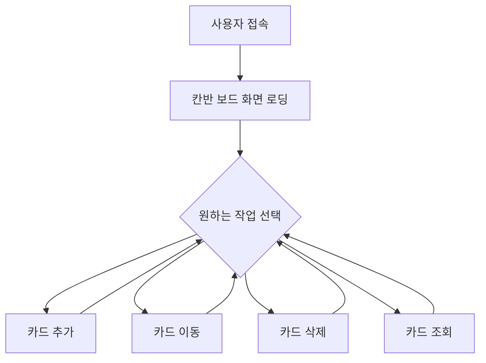

## 2. 상세 사용자 플로우

### 2.1 초기 진입 플로우

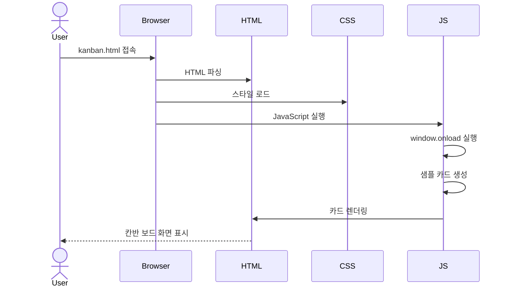

### 2.2 카드 추가 플로우

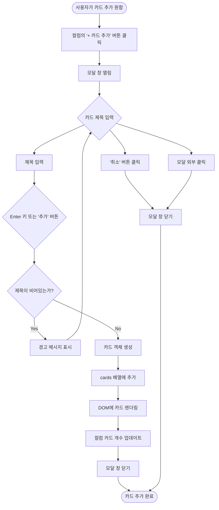

### 2.3 카드 이동 플로우 (드래그 앤 드롭)

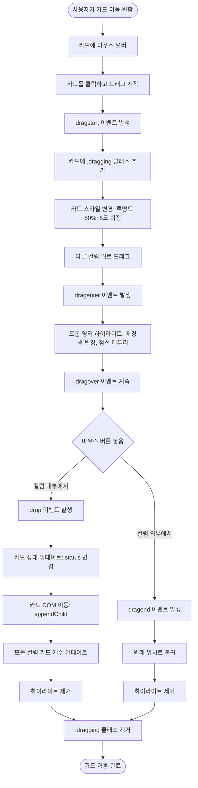

### 2.4 카드 삭제 플로우

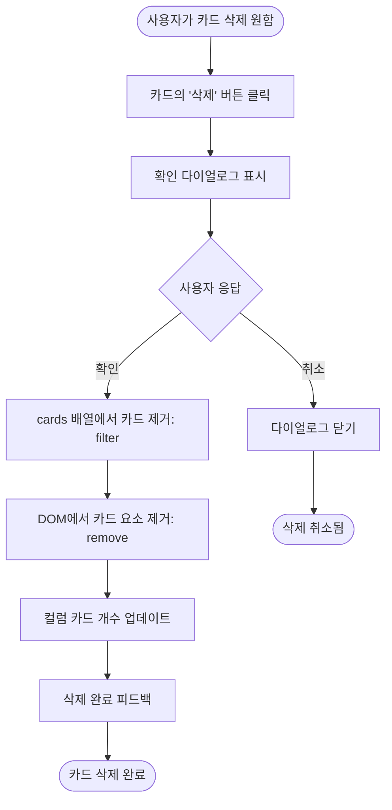

### 2.5 모달 인터랙션 플로우

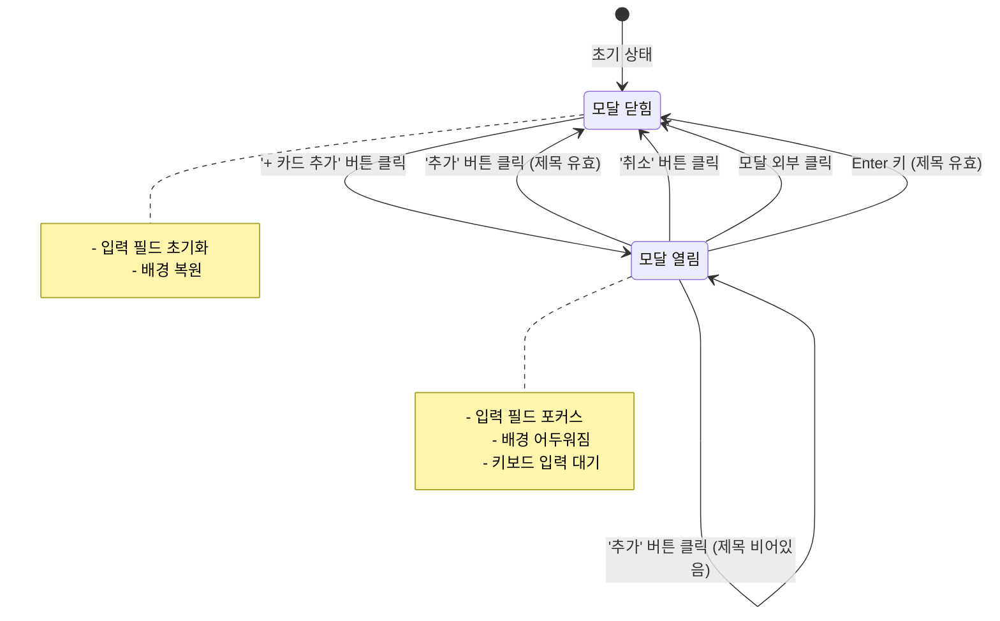

## 3. 컬럼별 카드 상태 전환

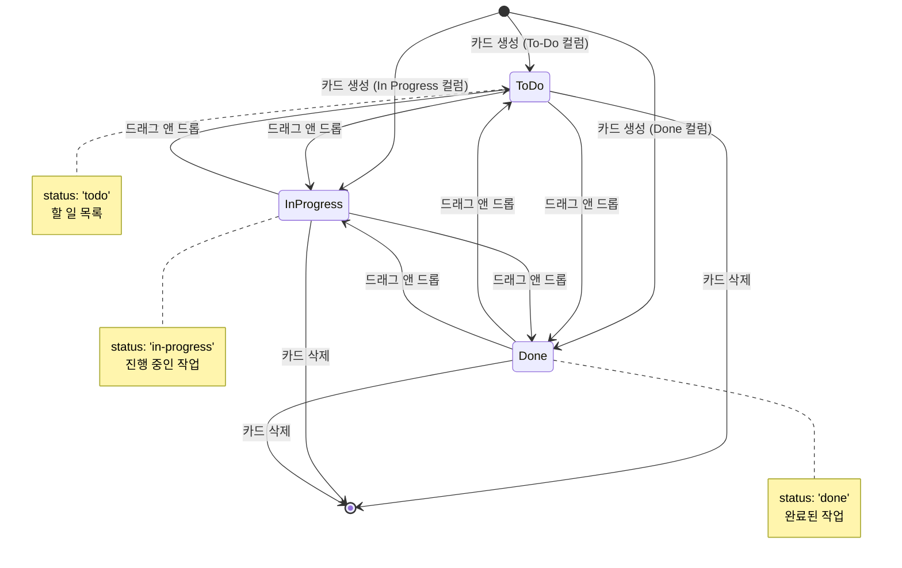

## 4. 이벤트 처리 흐름

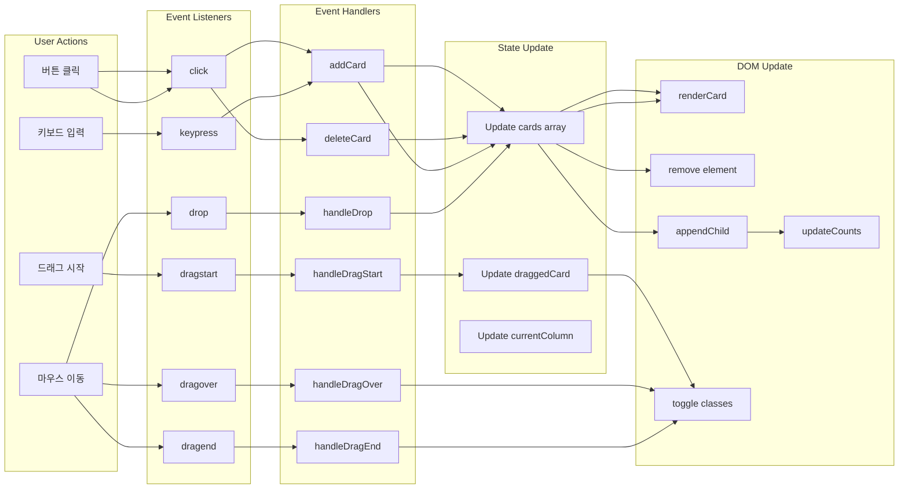

## 5. 에러 처리 플로우

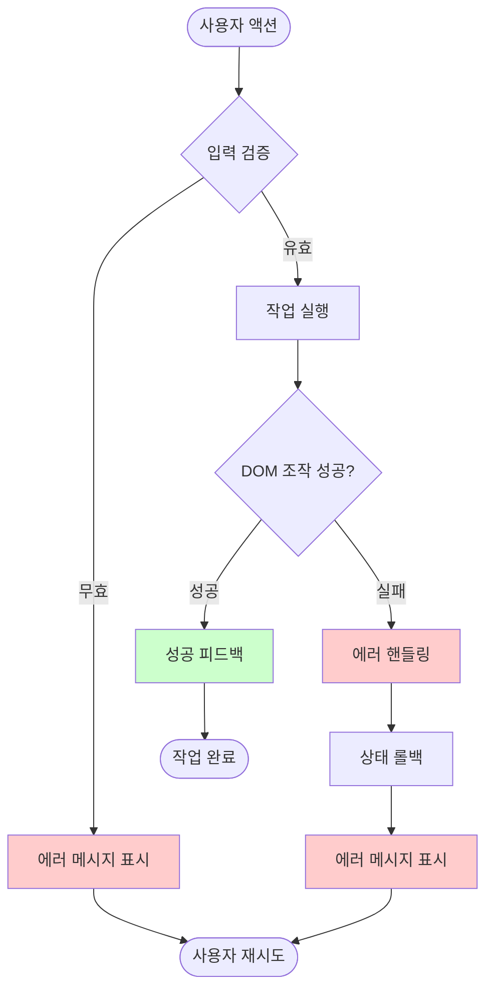

### 5.1 에러 시나리오별 처리

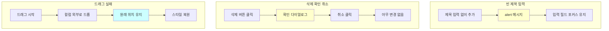

## 6. 데이터 흐름 (Phase 2: LocalStorage 추가)

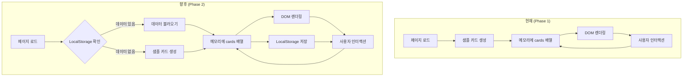

## 7. 반응형 디자인 플로우

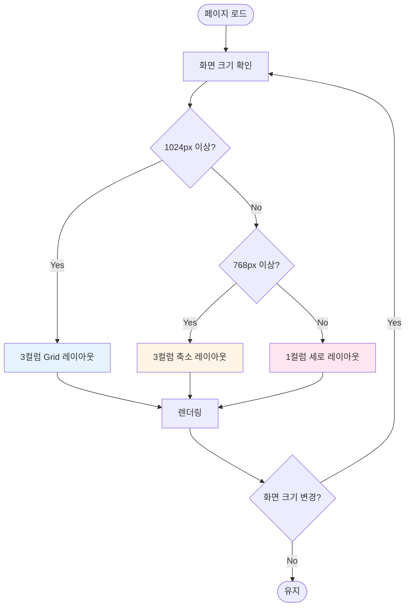

## 8. 키보드 네비게이션 (Phase 2 예정)

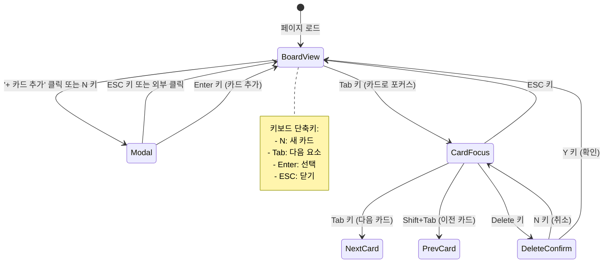

## 9. 사용자 시나리오별 플로우

### 9.1 시나리오 1: 신규 사용자의 첫 사용

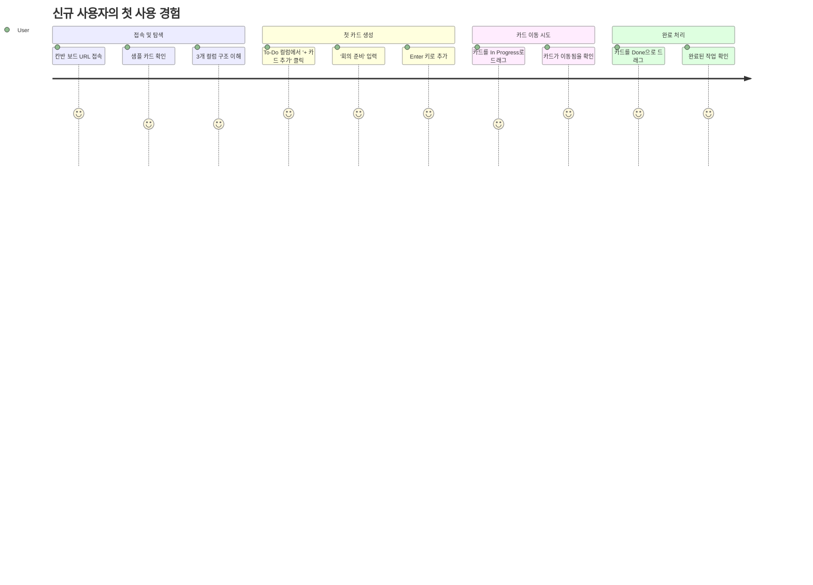

### 9.2 시나리오 2: 일일 작업 관리

```mermaid
journey
    title 일일 작업 관리 플로우
    section 아침: 작업 계획
      페이지 오픈: 5: User
      오늘 할 일 3개 추가: 5: User
      우선순위 확인: 4: User
    section 오전: 작업 시작
      첫 번째 작업 In Progress로 이동: 5: User
      작업 진행: 4: User
      완료 후 Done으로 이동: 5: User
    section 오후: 추가 작업
      두 번째 작업 In Progress로 이동: 5: User
      중간에 새 작업 추가: 4: User
      작업 완료 후 Done으로 이동: 5: User
    section 저녁: 정리
      완료된 작업 확인: 5: User
      내일 할 일 추가: 4: User
```

### 9.3 시나리오 3: 빠른 작업 추가 및 정리

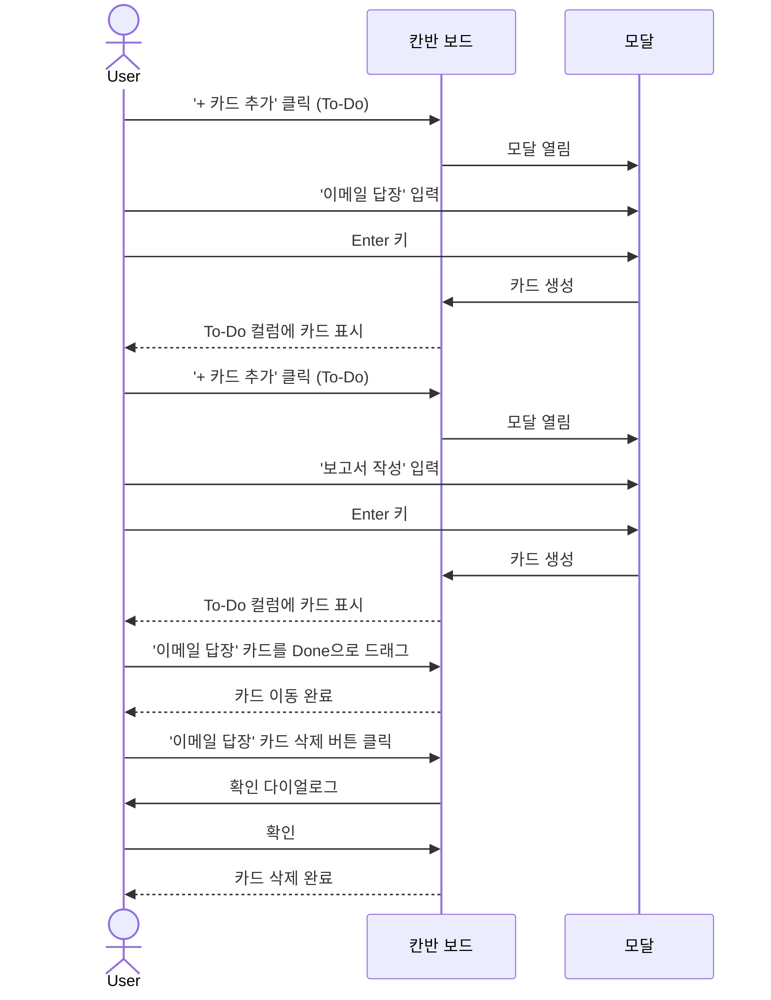

## 10. 성능 최적화 플로우

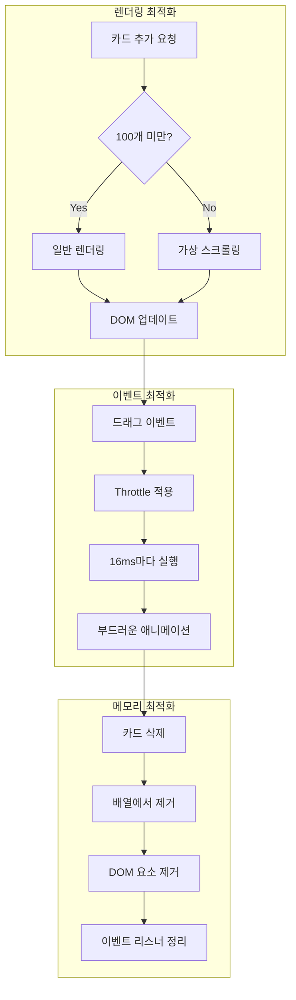

## 11. 요약

이 문서는 칸반 보드 애플리케이션의 모든 사용자 인터랙션 플로우를 Mermaid 다이어그램으로 시각화했습니다.

### 주요 플로우
1. **카드 추가**: 모달 기반 입력 → 검증 → 렌더링
2. **카드 이동**: 드래그 시작 → 시각적 피드백 → 드롭 → 상태 업데이트
3. **카드 삭제**: 확인 다이얼로그 → 배열 및 DOM 업데이트
4. **에러 처리**: 입력 검증 → 에러 메시지 → 재시도

### 향후 개선 (Phase 2+)
- LocalStorage 데이터 지속성
- 키보드 네비게이션
- 성능 최적화 (가상 스크롤링)
- 접근성 개선 (ARIA)
